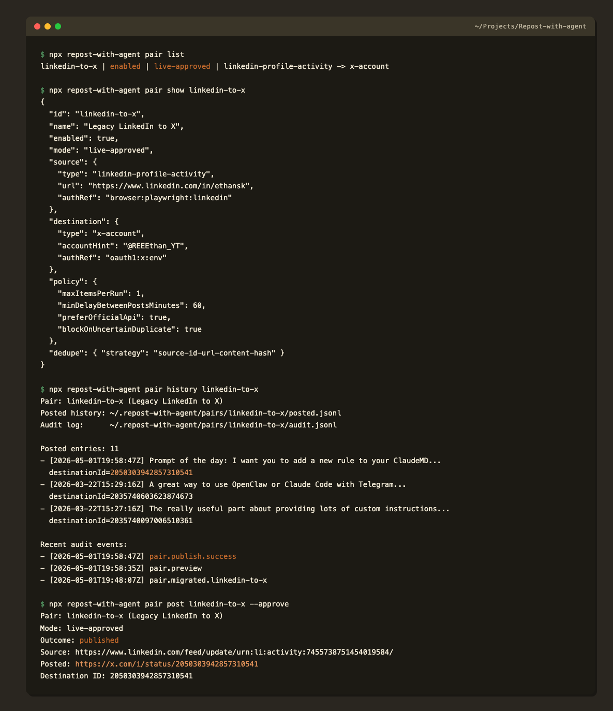
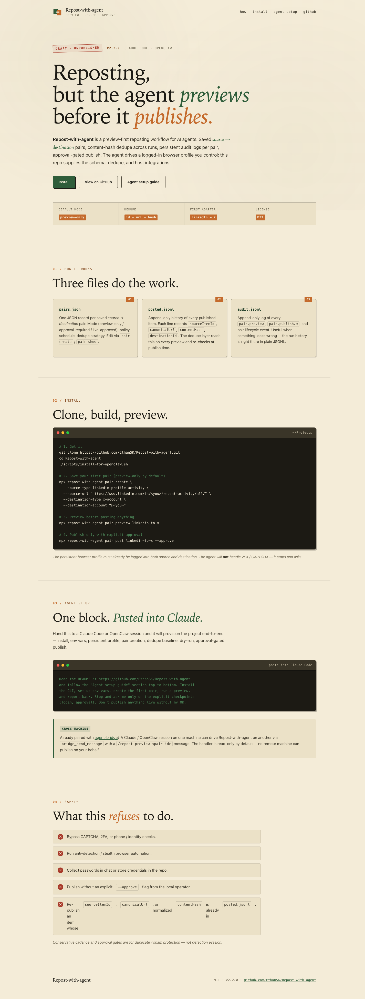

# Repost-with-agent

Preview-first agent reposting. Saved source → destination pairs, persistent history, real dedupe, no stealth, no ban evasion.

The agent does the reposting through a logged-in browser profile the user controls. This repo supplies the schema, dedupe, audit logs, learnings, adapters, CLI, and host integrations (Claude Code, OpenClaw, agent-bridge). It is *not* a standalone autonomous social-posting framework.

The first concrete adapter pair is LinkedIn source → X destination.

---

> **Important — Telegram-confirm every successful publish — non-negotiable.** Every successful post from this tool MUST trigger a Telegram message to Ethan confirming what was posted, the source URL, and the destination URL. The CLI does this automatically via the configured `notify.telegram` channel. If you are an agent operating on this repo and you trigger a publish through any non-CLI path (direct API call, scripted action, etc.) you MUST also fire a Telegram confirmation. Silent publishes are a bug. Wire it up once, before the first live publish:
>
> ```bash
> repost-with-agent notify configure --bot-token <TELEGRAM_BOT_TOKEN> --chat-id <CHAT_ID> --test
> ```
>
> (Ethan voice 5977 + 5978, 2026-05-01.)

---

## Agent setup guide

> **For an AI agent (Claude Code / OpenClaw) provisioning this for a new user.** Read this section top-to-bottom and execute. Stop and ask the user only on the explicit checkpoints.

### 1. Prereqs

- Node 18+ (`node --version`).
- macOS / Linux. Windows works but isn't routinely tested.
- A persistent browser profile dir for the agent to drive Playwright against. Default is `~/.claude/playwright-profile/` for Claude Code, `~/.openclaw/playwright-profile/` for OpenClaw. Override via `PLAYWRIGHT_PROFILE_DIR`.

### 2. Install

```bash
git clone https://github.com/EthanSK/Repost-with-agent.git
cd Repost-with-agent
./scripts/install-for-openclaw.sh    # works for Claude Code too — name is historical
```

The script: runs `npm install`, builds the TypeScript, smoke-tests `npx repost-with-agent --version`, creates `~/.repost-with-agent/`, prints the OpenClaw plugin id + skills root.

For Claude Code plugin install, point at `.claude-plugin/plugin.json`:

```bash
# in your Claude Code plugin root or via /plugins:
ln -s "$PWD/.claude-plugin" ~/.claude/plugins/repost-with-agent
```

### 3. Environment variables

Copy `.env.example` to `.env` and fill what you need:

| Var | Purpose |
| --- | --- |
| `LINKEDIN_PROFILE_URL` | The `/recent-activity/all/` URL of the LinkedIn account to mirror. |
| `PLAYWRIGHT_PROFILE_DIR` | Persistent browser profile path (must already be logged into LinkedIn). |
| `X_CLIENT_ID` / `X_CLIENT_SECRET` | X OAuth 2.0 PKCE app — only needed if using `repost-with-agent auth` for API-based posting. |
| `X_CHAR_LIMIT` | `25000` for X Premium, `280` otherwise. |
| `REPOST_DATA_DIR` | Override `~/.repost-with-agent` if needed. |
| `FACEBOOK_*` | Optional, deprecated path. Default off. |

### 4. Persistent browser login (one-time, human required)

The agent CANNOT log in for the user. The persistent profile must already have valid sessions for both source and destination. Have the human:

1. Open the Playwright profile dir manually (`npx playwright open --user-data-dir=$PLAYWRIGHT_PROFILE_DIR https://www.linkedin.com/`).
2. Log into LinkedIn (handle 2FA / CAPTCHA).
3. In the same profile, log into `https://x.com/`.

Stop and ping the user if either login challenge appears at runtime. **Never bypass CAPTCHA / 2FA / phone verification.**

### 5. Create the first pair

```bash
npx repost-with-agent pair create \
  --name "LinkedIn to X" \
  --source-type linkedin-profile-activity \
  --source-url "https://www.linkedin.com/in/<you>/recent-activity/all/" \
  --destination-type x-account \
  --destination-account "@<you>"
```

New pairs default to `mode: preview-only` and `enabled: false`. This is intentional. The agent must run a successful preview before flipping mode to `approval-required` (today: edit `~/.repost-with-agent/pairs.json` directly; a dedicated `pair edit` command is a future addition).

### 6. Dedupe baseline import (one-time, if migrating)

If the user previously ran the legacy `linkedin-to-x` tool, import its history so old posts don't re-publish:

```bash
npx repost-with-agent migrate linkedin-to-x \
  --source-url "https://www.linkedin.com/in/<you>/recent-activity/all/" \
  --destination-account "@<you>"
```

This creates a *separate* legacy pair, imports `~/.linkedin-to-x/posted.md` into per-pair `posted.jsonl`, and leaves the old files untouched. Verify with:

```bash
npx repost-with-agent pair history linkedin-to-x
```

The dedupe layer matches on `sourceItemId` → `canonicalUrl` → `contentHash`. All three must miss for an item to be considered new. See `src/core/dedupe.ts`.

### 7. Dry run / preview

```bash
npx repost-with-agent pair preview <pair-id>
```

Outputs auth health, candidate list, drafted post text, dedupe decision (`new` / `duplicate` / `uncertain`), and any warnings. Posts nothing. Audit-logs to `~/.repost-with-agent/pairs/<pair-id>/audit.jsonl`.

### 8. Approval-required publish

The agent never auto-publishes. To live-publish the next eligible candidate:

```bash
npx repost-with-agent pair post <pair-id> --approve
```

Mode must be `approval-required` or `live-approved`. The command re-runs preview, re-checks dedupe at post-time (race-safe), and refuses if the top candidate is `uncertain` unless you also pass `--allow-uncertain`. On success it appends to `posted.jsonl` with `sourceItemId`, `canonicalUrl`, `contentHash`, `destinationId`, `postedAt`, `summary`.

### 9. Telegram-on-publish notifier (mandatory before first live run)

**Telegram-confirm every successful publish — non-negotiable.** Wire this up once per machine before flipping any pair to live. The CLI fires a Telegram message immediately after every confirmed publish (manual `pair post --approve`, `pair scheduled-run --allow-publish`, `pair backfill --allow-publish`). Silent publishes are a project bug.

```bash
repost-with-agent notify configure \
  --bot-token <TELEGRAM_BOT_TOKEN> \
  --chat-id <CHAT_ID> \
  --test
```

`--test` sends a one-off "wired up" message so you can confirm delivery before relying on it.

Config sources (priority order):

1. `~/.repost-with-agent/notify.json` (written with mode `0600` because the bot token is sensitive).
2. Env vars `REPOST_TELEGRAM_BOT_TOKEN` + `REPOST_TELEGRAM_CHAT_ID` (fallback for CI / cron environments).

If neither is set, every successful publish prints a loud `WARN` to stderr **and** writes a `pair.publish.notify_skipped_unconfigured` audit event so the omission is impossible to miss.

Audit events emitted alongside the existing `pair.publish.success`:

- `notify.publish.success` — Telegram delivered.
- `notify.publish.failure` + `pair.publish.notify_failed` — Telegram HTTP / network error. Publish itself stays successful; this is non-fatal but means Ethan didn't get the ping.
- `pair.publish.notify_skipped_unconfigured` — no notify config found.

Inspect / re-test:

```bash
repost-with-agent notify status        # masked token + resolved source
repost-with-agent notify test          # send a one-off test notify
```

### 10. Sanity checklist before handing back to the user

- [ ] `npx repost-with-agent pair list` shows the new pair.
- [ ] `npx repost-with-agent pair preview <id>` succeeds without auth errors.
- [ ] `~/.repost-with-agent/pairs/<id>/posted.jsonl` exists (or is empty if first run).
- [ ] `audit.jsonl` has a `pair.created` and `pair.preview` entry.
- [ ] **`repost-with-agent notify status` reports `source: file` (or `env`), not `none`. Required before any live publish — see §9.**
- [ ] Cron / launchd / OpenClaw schedule (if requested) is registered with `max_items_per_run: 1` and `approval: manual` unless the user explicitly asked for live.

---

## Terminology

| Term | Meaning |
| --- | --- |
| **Pair** | A saved (source, destination, policy, schedule) record stored in `~/.repost-with-agent/pairs.json`. Identified by a slug like `linkedin-to-x`. |
| **Source** | Where content is fetched from. Currently: `linkedin-profile-activity`. The source adapter scrapes via the persistent Playwright profile. |
| **Destination** | Where content is published. Currently: `x-account`. The destination adapter uses X OAuth 2.0 (PKCE) tokens stored in `~/.repost-with-agent/x-tokens.json`. |
| **Adapter** | The thin per-platform layer that exposes `test()`, `fetchCandidates()`, `preview()`, `publish()`. Lives under `src/adapters/sources/` and `src/adapters/destinations/`. Add a new platform = add a new adapter. |
| **Preview** | Read-only run: auth check + candidate fetch + draft + dedupe decision. Posts nothing. Always idempotent. |
| **Approve** | A human / authorized agent setting `--approve` (and optionally `--allow-uncertain`) on `pair post`. Without it the orchestrator returns `needs-approval` and writes nothing. |
| **Publish** | The actual destination call. Only happens when (a) mode is not `preview-only`, (b) `--approve` is set, (c) dedupe re-check at post-time is clean, (d) destination auth health is `ok`. |
| **`posted.jsonl`** | Per-pair history at `~/.repost-with-agent/pairs/<id>/posted.jsonl`. One JSON line per published item. Schema: `sourceItemId`, `canonicalUrl`, `contentHash`, `destinationType`, `destinationId`, `postedAt`, `summary`. The dedupe layer reads this on every preview / post. |
| **`audit.jsonl`** | Per-pair audit log at `~/.repost-with-agent/pairs/<id>/audit.jsonl`. Records every `pair.preview`, `pair.publish.*`, `pair.created`, etc. event. Useful for debugging duplicates and run failures. |
| **Dedupe baseline** | The set of `posted.jsonl` entries an agent / migration has loaded into the pair before its first live run. Critical: any new candidate with a matching `sourceItemId`, `canonicalUrl`, or normalized `contentHash` is rejected before the destination call. |
| **`accountHint`** | Human-readable destination identifier (e.g. `@example`) stored on the pair. Not the auth credential — auth lives in `authRef` plus the OAuth token store. |
| **Pair mode** | One of `preview-only` (default; refuses to publish), `approval-required` (publishes only with explicit `--approve`), `live-approved` (publishes with `--approve`; reserved for trusted operator-driven runs). |
| **Workspace** | An optional user-owned directory created by `scripts/init_repost_with_agent_workspace.py`. Holds `user-setup.json`, `queue.jsonl`, `state.json`, `logs/`. Use this when you want queue-driven runs instead of pair-driven runs. |
| **Run policy** | Schedule + concurrency knobs on a pair or workspace: `max_items_per_run`, `min_interval_minutes`, `approval`, `mode`. Read by the host scheduler, not by the CLI itself. |
| **Learnings** | A free-form Markdown file at `~/.repost-with-agent/pairs/<id>/learnings.md` loaded before every preview / run. Record duplicate patterns, formatting quirks, platform cautions there. |

---

## Principles

- Preview first. New pairs default to `preview-only`.
- User controlled. No hidden posting, no stealth, no CAPTCHA / 2FA bypass.
- Official APIs where possible.
- Agent-operated browser flows where APIs are unavailable, using a persistent profile the user controls.
- Multiple saved pairs with persistent history, audit logs, and learnings loaded every run.
- Usable through OpenClaw or Claude Code as the operator, without making the project about agent infrastructure.

## Install

```bash
npm install
npm run build
```

Or use the one-shot installer:

```bash
./scripts/install-for-openclaw.sh
```

The public CLI is:

```bash
npx repost-with-agent --help
```

Legacy alias still works:

```bash
npx linkedin-to-x --help
```

## Runtime state

Public repo files stay in the repo. Runtime state stays outside it:

```text
~/.repost-with-agent/
  pairs.json
  x-tokens.json
  notify.json                 # Telegram-on-publish config (mode 0600)
  pairs/<pair-id>/
    audit.jsonl
    drafts.jsonl
    findings.jsonl
    posted.jsonl
    state.json
    learnings.md
```

Legacy runtime state stays at `~/.linkedin-to-x/`; migration imports from it without deleting or archiving it.

## Agent workspace template

For queue-based agent runs, create a user-owned workspace outside the repo:

```bash
python3 scripts/init_repost_with_agent_workspace.py ~/repost_with_agent_workspace
```

That creates:

```text
repost_with_agent_workspace/
  user-setup.json   # accounts, browser profile, target platforms, publish/run policy
  queue.jsonl       # one queued repost item per line
  state.json        # completed/drafted/blocked/failed/skipped tracking
  logs/             # concise proof and run notes
```

Default workspace policy is manual / approval-first: the agent may prepare previews / drafts, but must stop before public posting unless the current request and setup explicitly authorize live posting.

## Pair commands

```bash
npx repost-with-agent pair create ...      # see Agent setup guide §5
npx repost-with-agent pair list
npx repost-with-agent pair show <id>
npx repost-with-agent pair preview <id>
npx repost-with-agent pair history <id>
npx repost-with-agent pair post <id> --approve [--allow-uncertain]
npx repost-with-agent pair backfill <id> --max 20 --pages 2 --interval-minutes 10
                                           # plan-only by default; pass
                                           # --allow-publish to live-publish a
                                           # backfill batch (requires
                                           # mode=live-approved). Cross-state
                                           # dedupe against both posted.jsonl
                                           # AND destination history. See
                                           # docs/WORKFLOW.md "Backfill mode".
```

## X auth

If you want to prepare X OAuth2 tokens for live posting:

```bash
npx repost-with-agent auth
```

Tokens stored in `~/.repost-with-agent/x-tokens.json`. If new tokens are absent, the tool also checks the legacy location `~/.linkedin-to-x/x-tokens.json`.

## Notify commands

```bash
npx repost-with-agent notify configure --bot-token <T> --chat-id <C> [--test] [--disable]
npx repost-with-agent notify status
npx repost-with-agent notify test [--pair-id <id>]
```

**Telegram-confirm every successful publish — non-negotiable.** See §9 of the Agent setup guide for the full contract.

## Migration from `linkedin-to-x`

```bash
npx repost-with-agent migrate linkedin-to-x \
  --source-url "https://www.linkedin.com/in/<you>/recent-activity/all/" \
  --destination-account "@<you>"
```

Behavior:

- creates a disabled `preview-only` pair;
- imports old `~/.linkedin-to-x/posted.md` entries into per-pair `posted.jsonl`;
- records an audit event with the known duplicate incident: 2026-03-24 duplicate post `https://x.com/i/status/2036422890271215716`, fix commit `9d37108`;
- leaves legacy files untouched.

## Scheduling

Scheduling is host-driven. Repost-with-agent does not run a daemon — OpenClaw cron / launchd / system cron fires the tick and invokes a deterministic CLI entry point that runs preview-or-publish under the saved policy and emits structured `pair.scheduled.*` audit events.

Per-tick CLI entry point (host scheduler should call this):

```bash
repost-with-agent pair scheduled-run <pair-id> [--allow-publish] [--json]
```

Helpers to wire up the host scheduler:

```bash
repost-with-agent pair schedule <pair-id>            # render launchd plist + crontab line + openclaw cron command
repost-with-agent pair schedule <pair-id> --apply launchd
                                                     # write ~/Library/LaunchAgents/com.repost-with-agent.<id>.plist
repost-with-agent pair unschedule <pair-id>          # remove the launchd plist
repost-with-agent pair edit <pair-id> --schedule-kind cron --schedule-expression "0 10 * * 1-5" --timezone Europe/London
                                                     # update the saved schedule fields
```

See [docs/scheduling.md](docs/scheduling.md) for the outcome taxonomy, audit-log format, cron-to-launchd translation rules, and the full safety matrix.

Recommended flow:

1. create the pair
2. preview it
3. inspect history / learnings
4. `pair edit <id>` to set the schedule fields (`--schedule-kind cron --schedule-expression "..."` etc.)
5. `pair schedule <id>` and apply to your scheduler of choice
6. tail `~/.repost-with-agent/pairs/<id>/audit.jsonl` to confirm ticks fire

Scheduled ticks default to **preview-only**. `--allow-publish` is opt-in AND requires `pair.mode === "live-approved"`. Do not schedule blind public posting by default.

### OpenClaw cron example

`pair schedule <id>` prints a ready-to-run `openclaw cron add` command. The example below is the equivalent hand-written form:

```bash
openclaw cron add \
  --name "Repost-with-agent preview" \
  --cron "0 10 * * 1-5" \
  --tz "Europe/London" \
  --session isolated \
  --message "Use the repost-with-agent skill. Run \`repost-with-agent pair scheduled-run linkedin-to-x\`. Read its JSON stdout, summarise outcome (preview-only / new-candidate / duplicate / blocked / published), and report any blockers. Do NOT pass --allow-publish unless the saved policy explicitly authorises live posting." \
  --announce
```

For a queue workspace, make the workspace path explicit in the message:

```bash
openclaw cron add \
  --name "Repost workspace preview" \
  --cron "0 10 * * *" \
  --tz "Europe/London" \
  --session isolated \
  --message "Use the repost-with-agent skill with ~/repost_with_agent_workspace. Read user-setup.json, queue.jsonl, state.json, and logs; process at most 1 eligible item; stop at draft/preview when publish_mode or approval is manual; update state/logs; announce the result." \
  --announce
```

Inspect:

```bash
openclaw cron list
openclaw cron show <job-id>
openclaw cron runs --id <job-id>
```

## Agent-bridge integration

Repost-with-agent is reachable via [agent-bridge](https://github.com/EthanSK/agent-bridge) so a Claude / OpenClaw session on one machine can drive a Repost-with-agent install on another.

**Pattern:** the remote agent receives a natural-language `/repost <verb> [args]` message and routes it to `scripts/agent-bridge-handler.sh`, which wraps the safe subset of CLI commands. There is no separate MCP server — the existing `bridge_send_message` channel + a shell handler is enough.

From the calling side:

```text
bridge_send_message({
  machine: "<paired-machine>",
  target: "claude-code" | "openclaw/<account>",
  message: "/repost preview linkedin-to-x"
})
```

The receiving agent reads `scripts/agent-bridge-handler.sh` and runs the matching verb:

| Verb | Maps to |
| --- | --- |
| `list` | `pair list` |
| `show <id>` | `pair show <id>` |
| `preview <id>` | `pair preview <id>` |
| `history <id>` | `pair history <id>` |
| `scheduled-run <id>` | `pair scheduled-run <id> --json` (always preview-only over the bridge — never propagates `--allow-publish` from a remote agent) |
| `schedule <id>` | `pair schedule <id>` (read-only render of scheduling artifacts) |
| `status` | env summary + pair count |
| `safe-publish <id>` | refuses; emits a JSON `needs-approval` stub asking the local operator to run the publish themselves |

The handler is deliberately read-only / approval-gated. **No remote machine can publish on your behalf.** A live publish always needs the local operator to run `pair post <id> --approve` directly.

## Agent-operated setup files

The repo ships lightweight host integration so an agent can drive the workflow without re-implementing scraping / posting:

- `openclaw.plugin.json`
- `.claude-plugin/plugin.json`
- `skills/repost-pair-setup/SKILL.md`
- `skills/repost-run/SKILL.md`
- `commands/pair.md`
- `commands/preview.md`
- `commands/run.md`
- `scripts/install-for-openclaw.sh`
- `scripts/agent-bridge-handler.sh`

These integrations are only for controlling the cross-posting workflow: create pairs, preview, inspect history, run / schedule safely. They are not a separate agent app / framework.

## Legacy commands

Old direct commands are still present for compatibility and are marked deprecated:

- `repost-with-agent sync`
- `repost-with-agent list`
- `repost-with-agent start`

These preserve the old hardcoded LinkedIn → X / Facebook behavior and use the legacy tracker location (`~/.linkedin-to-x/posted.md`, overrideable with `LINKEDIN_TO_X_DATA_DIR`). New setup should use `pair` commands.

Facebook support is treated as legacy / experimental until a cautious destination adapter exists. Do not enable blind Facebook posting by default; keep it approval-gated and explicitly configured.

## Safety

- No stealth, ban evasion, or anti-detection logic.
- No CAPTCHA or 2FA bypass.
- No password collection in chat.
- Browser automation is only for transparent, user-controlled login sessions.
- Conservative cadence is for spam / duplicate reduction, not detection evasion.
- Live posting requires explicit `--approve`; the orchestrator re-checks dedupe at post-time.

See [docs/WORKFLOW.md](docs/WORKFLOW.md) for the full end-to-end walkthrough, [docs/scheduling.md](docs/scheduling.md) for the host-scheduler contract, plus [docs/architecture.md](docs/architecture.md), [docs/setup-flow.md](docs/setup-flow.md), [docs/safety.md](docs/safety.md), [docs/migration.md](docs/migration.md).

## Screenshots

CLI session — `pair list` / `pair show` / `pair history` / live `pair post --approve`:



GitHub Pages site (`site/index.html`):



Live test post produced by `pair post --approve` on 2026-05-01: https://x.com/REEEthan_YT/status/2050303942857310541.

## License

MIT. See [LICENSE](LICENSE).
